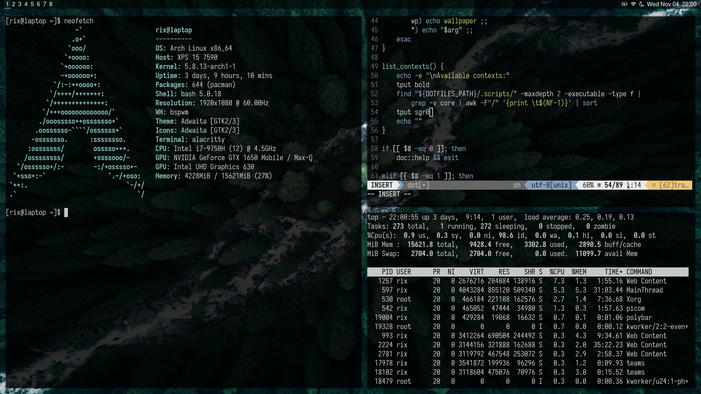

<h1 align="center"><a href="https://medium.com/@webprolific/getting-started-with-dotfiles-43c3602fd789">.files</a> and configs</h1>
<p align="center">


</p>

<p align="center">
  
</p>

<p align="center">
  <a href="bin/dot"><code>dot</code></a>&nbsp;&nbsp;•&nbsp;
  <a href="scripts">Scripts</a>&nbsp;&nbsp;•&nbsp;
  <a href="shell">Shell</a>
</p>

## Installation
The installation of this dotfiles is pretty straightforward: just run the next command in your terminal and follow the installation process.
```bash
curl -s https://raw.githubusercontent.com/rixsilverith/dots/master/installer
```

## Running the `dot` command
The `dot` command is key here, as it is the main utility you'll use to manage this dotfiles, and it acts as the entry point for most of the scripts available. Once the dotfiles are installed in your system you should be able to execute `dot` in your terminal of choice to get a full list of the available scripts. The syntax is as follows:
```bash
dot <context> [subcontext] <cmd> [<args>...]
```
In a few words, a *context* is a group of related scripts. For instance, the scripts under the `net` context do stuff with network connections and interfaces, and so on.

## Updating the dotfiles
Updating the dotfiles is as simple as running `dot self update` in your terminal. This script will check for updates by looking the [dot](bin/dot) file in this repo and comparing it with the one you have in your machine. If an updated version is found, the `update` script will ask you if you wanna procceed with the installation. You can check the current version by running `dot -v`.

*Warning*: Note that this process may break your system configuration, and for this reason is strongly recommended to backup your current dotfiles folder before installing the update, by default `$HOME/.dots`.

## References
- The `dot` command, as well as some scripts in these dotfiles, is pretty much based on the [denisidoro](https://github.com/denisidoro/dotfiles) and [rgomezcasas](https://github.com/rgomezcasas/dotfiles) developed for their own dotfiles.

- The custom GTK theme and icons are the work of [Juicyexe](https://github.com/Juicyexe/arch-monochrome).

## License
The MIT License. See [License](LICENSE) for more information.
