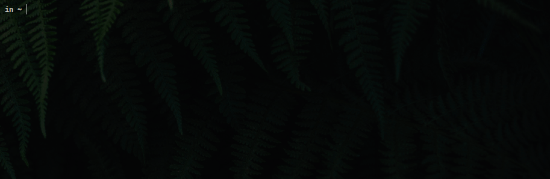

# Dots [](https://mit-license.org/)

Just another <a href="https://medium.com/@webprolific/getting-started-with-dotfiles-43c3602fd789">.files</a> and configurations repository, but these are my own.
These .files aim to keep the **~** directory as clean as possible while having system configuration files organized in a simple, maintainable and structured way.

<p><br>
<!--<br><sub>Simple, keyboard and terminal-based .files.</sub>-->
</p>

<!--## Overview and the `doit` script-->

---

## Overview

This environment is based on the [Hyprland](https://hyprland.org/) experimental Wayland compositor and
intended to work in an [Arch Linux](https://archlinux.org/) distribution. In these .files, the
<a href="bin/doit"><code>doit</code></a> command is ment to act as a hub for running the different
scripts and utilities included, as well as for managing the .files themselves. It can be run as

`doit <context> <script> [<args>...]`

<!--
```bash
doit <context> <script> [<args>...]
``` -->
where a *context* is just a group of related scripts (e.g. ui, shell). A full list of the included scripts and their
documentation is available by either running <a href="bin/dot"><code>doit</code></a> without arguments or
by pressing the <kbd>Ctrl</kbd> + <kbd>F</kbd> keybind in your terminal of choice.

---

## Installation

> **Note** It is strongly recommended to do the installation on a fresh Arch Linux installation. The installation of these .files in an already configured system will more likely than not break stuff. So just in case backup your things before running the bootstraping script.
Installing these .files is as simple as running
```console
curl -s https://raw.githubusercontent.com/rixsilverith/dots/master/bootstrap.sh | bash
```

## Updating the .files

Just `git pull` and `doit self link` to update the dotfiles with the latest commit and everything should be fine. Or not.

## Acknowledgements

- The `doit` command, as well as some scripts in these dotfiles, is pretty much based on the one [denisidoro](https://github.com/denisidoro/dotfiles) and [rgomezcasas](https://github.com/rgomezcasas/dotfiles) developed for their own dotfiles.

- The custom GTK theme and icons are the work of [Juicyexe](https://github.com/Juicyexe/arch-monochrome).

## License

The MIT License. See [LICENSE](LICENSE) for more information. A copy of the
license can be found along with the code.
